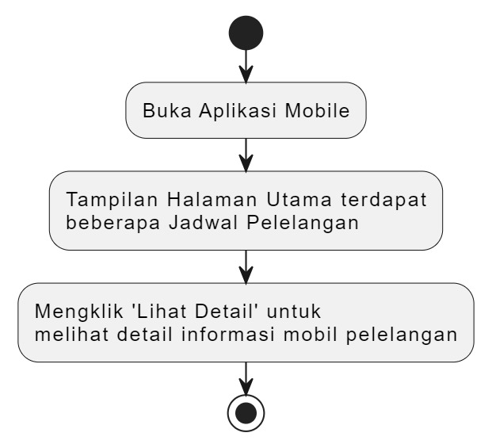

# Mobile Apps E-Pelelangan Mobil

**Business Domain: Mobile Apps E-Pelelangan Mobil**
**Business Process: Informasi E-Pelelangan Mobil**

## Introduction
Dengan tingginya minat masyarakat terhadap pelelangan mobil, dibutuhkan sebuah aplikasi pelelangan mobil yang memudahkan akses pengguna terhadap informasi pelelangan. Aplikasi ini dirancang untuk menyediakan detail mengenai jadwal pelelangan, lokasi pelelangan, jenis mobil yang dilelang, kondisi mobil, tahun mobil, starting bid (harga awal yang ditawarkan) dan nomer WhatsApp yang dapat dihubungi.

---

## Objective
- Mempermudah pengguna dalam mencari dan mengikuti jadwal pelelangan mobil serta memperoleh informasi mendetail tentang setiap mobil yang dilelang.

---

## Scope
### Batasan:
- Aplikasi hanya bisa memberikan informasi jadwal dan detail mobil pelelangan saja.

### Kriteria:
- Pengguna dapat melihat jadwal pelelangan, detail kendaraan, starting bid (harga awal yang ditawarkan), lokasi dan nomer WhatsApp. 

---

## Business Requirement
### Jenis Layanan:
Layanan Informasi E-Pelelangan Mobil

### Definisi:
Aplikasi ini hanya berfungsi sebagai penyedia informasi pelelangan tanpa fitur untuk mengikuti pelelangan atau melakukan transaksi langsung.

---

## Fungsi
### Fungsi Teknis:
**1. Jadwal Pelelangan**  
   Menyediakan informasi terkini mengenai jadwal pelelangan, termasuk tanggal, waktu, dan lokasi.
   
**2. Detail Mobil**  
   Setiap mobil yang akan dilelang memiliki halaman detail yang mencakup informasi merk mobil, jenis kendaraan, tahun mobil, starting bid, deskripsi singkat tentang kondisi kendaraan (misal, “baik”, ‘sangat baik”, “perlu perbaikan”, dll).

### Fungsi Strategis:
**1. Peningkatan Akses Informasi**  
   Aplikasi mempermudah pengguna dalam mendapatkan informasi pelelangan tanpa perlu mengunjungi tempat pelelangan secara langsung mengenai informasi dari pelelangan.
   
**2. Pengambilan Keputusan**  
   Dengan informasi yang terstruktur (jadwal, detail mobil, starting bid), pengguna dapat membuat keputusan lebih cepat dan tepat dalam memiliki pelelangan yang diminati.

---

## Fungsional & Spesifikasi
### Process Flows:

### Spesifikasi:
Memberikan akses mudah dan akurat kepada pengguna terhadap informasi pelelangan mobil, termasuk jadwal, jenis mobil, tahun mobil, lokasi, detail kondisi mobil dan starting bid (penawaran awal). 
